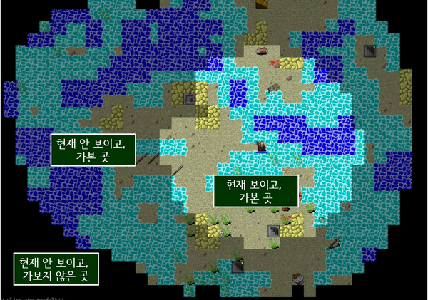

# 7장 신뢰할 수 없는 코드를 쓰면서 불변성 지키기

## 이번 장에서 살펴볼 내용

- 레거시 코드나 신뢰할 수 없는 코드로부터 내 코드를 보호하기 위해 방어적 복사를 만듭니다
- 앝은 복사와 깊은 복사를 비교합니다
- 카피-온-라이트와 방어적 복사를 언제 사용하면 좋은지 알 수 있습니다

## 레거시 코드와 불변성

저번 장 까지 어쩐지 깊은 복사 이야기 없이 얕은 복사만으로 불변성을 구현하더라니 이번 장에는 레거시 코드 이야기와 함께 깊은 복사 얘기가 나오네요.

아래 코드는 기존 레거시 코드에 행사를 위한 함수를 추가하고 있습니다만, 다만 `blackFridayPromotion()` 함수는 내부적을 상태를 mutate한다는 문제가 있습니다. 어떻게 해결해야 할까요?

```ts
function addItemToCart(name: string, price: number) {
  // 레거시 코드
  const item = makeCartItem(name, price);
  shoppingCart = addItem(shoppingCart, item);
  const total = calcTotal(shoppingCart);
  setCartTotalDom(total);
  updateShippingIcons(shoppingCart);
  updateTaxDom(total);
  // highlight-next-line
  blackFridayPromotion(shoppingCart); // 블랙 프라이데이 행사를 위한 코드 추가
}
```

이때 `방어적 복사(defensive copy)`를 사용하면 레거시 코드를 수정하지 않고도 내 코드를 보호할 수 있습니다.

## 우리가 만든 카피-온-라이트 코드는 신뢰할 수 없는 코드와 상호작용해야 합니다

위에 말했듯 새로 추가되는 함수는 상태를 mutate하기 때문에 불변성을 지킬 수 없습니다. 불변성을 깨트리는 신뢰할 수 없는 코드(안전지대 바깥)와 우리의 코드 베이스가 상호작용할 때가 있을겁니다.

그간 우리가 만든 카피-온-라이트 코드는 불변성을 지키기 위해 얕은 복사를 사용했지만, 이번에는 깊은 복사를 사용해야 합니다.



깊은 복사를 사용하면 참조를 끊을 수 있습니다. 즉 신뢰할 수 없는 코드가 참조에 접근하여 데이터를 손상시킬 수 있는 수단을 제거할 수 있습니다.

카피 온 라이트와 깊은 복사의 차이는, 카피 온 라이트는 무엇이 바뀌는지 알기 때문에 무엇을 복사해야 할지 결정할 수 있습니다. 반면 깊은 복사는 무엇이 바뀌는지 모르기 때문에 모든 것을 복사해야 합니다. 물론 복사본을 만든다는 점에 있어서는 동일합니다.

## 방어적 복사는 원본이 바뀌는 것을 막아줍니다

우리가 안전하게 잘 가꿔놓은 영역을 `안전지대`라고 부른다면, 안전지대 안팎으로 통행하는 데이터들은 모두 깊은 복사를 사용하여 복사본을 사용하도록 해야합니다. 참조를 끊어야 하기 때문입니다.

## 방어적 복사 구현하기

방어적 복사를 구현하기 위한 두 가지 규칙이 있습니다. 위에 언급한 `안전지대` 경계를 통과할 때 복사하는 것입니다.

1. 데이터가 안전한 코드에서 나갈 때 복사하기
2. 안전한 코드로 데이터가 들어올 때 복사하기

위 규칙을 준수하여 예제를 개선해보겠습니다. 방어적 복사와 관련된 코드를 감싸면 더 좋은 코드가 될 것 같습니다.

```ts
function addItemToCart(name: string, price: number) {
  // ...
  updateTaxDom(total);
  const cartCopy = deepCopy(shoppingCart);
  blackFridayPromotion(cartCopy); // 블랙 프라이데이 행사를 위한 코드 추가
  // highlight-next-line
  shoppingCart = blackFridayPromotionSafe(cartCopy);
}

// 함수가 하는 일이 명확해보이도록 함수를 분리 - 세부 구현은 은닉
function blackFridayPromotionSafe(cart: Cart) {
  const cartCopy = deepCopy(cart);
  blackFridayPromotion(cartCopy);
  return deepCopy(cartCopy);
}
```

## 방어적 복사가 익숙할 수도 있습니다

- API를 호출할 때 방어적 복사 개념이 자연스럽게 구현되고 있습니다. HTTP 통신을 할 때 직렬화를 하니까요.
- 얼랭(Erlang)과 엘릭서(Elixir) 같은 함수형 언어는 데이터를 주고 받거나 프로세스에서 데이터가 나갈 때 등등의 상황에서 데이터를 복사합니다.

## 깊은 복사는 얕은 복사보다 비쌉니다

깊은 복사는 원본과 어떤 데이터 구조도 공유하지 않습니다. 중첩된 모든 객체와 배열을 재사용하지 않고 복사본을 떠서 사용햡니다. 얕은 복사는 구조적 공유가 일어나므로 참조가 유지됩니다.

이러한 특징은 깊은 복사에 신뢰성을 더하는 요소이기도 하지만, 한편으로는 연산의 비용이 더 들어가는 요소가 됩니다. 깊은 복사는 얕은 복사보다 비쌉니다.

## 자바스크립트에서 깊은 복사를 구현하는 것은 어렵습니다

자바스크립트에서 깊은 복사를 구현하는 것은 어렵습니다. 자바스크립트는 객체를 참조로 전달하기 때문에 객체를 복사하려면 객체를 재귀적으로 복사해야 합니다. 이는 깊은 복사를 구현하는 데 많은 시간이 걸립니다.

아래는 완벽하지는 않지만 간단한 예제 코드입니다

```ts
function deepCopy(obj: any) {
  // null이나 원시 값은 그대로 반환
  if (typeof obj !== 'object' || obj === null) {
    return obj;
  }
  // 배열인 경우
  const copy = Array.isArray(obj) ? [] : {};

  // 모든 키를 재귀적으로 복사
  for (const key in obj) {
    copy[key] = deepCopy(obj[key]);
  }
  // 모든 연산 후에는 복사본을 반환
  return copy;
}
```

## 카피-온-라이트와 방어적 복사의 대화

... 이상하니 넘어가자.

## 요점 정리

- 방어적 복사는 불변성을 구현하는 원칙입니다. 데이터가 들어오고 나갈 때 복사본을 만듭니다
- 방어적 복사는 깊은 복사를 합니다. 그래서 카피 온 라이트보다 비용이 더 듭니다
- 카피 온 라이트와 다르게 방어적 복사는 불변성 원칙을 구현하지 않은 코드로부터 데이터를 보호해 줍니다
- 복사본이 많이 필요하지 않기 때문에 카피 온 라이트를 더 많이 사용합니다. 방어적 복사는 신뢰할 수 없는 코드와 함께 사용할 때만 사용합니다
- 깊은 복사는 위에서 아래로 중첩된 데이터 전체를 복사합니다. 얕은 복사는 필요한 부분만 최소한으로 복사합니다
