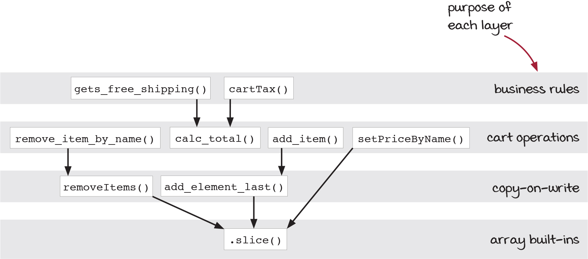
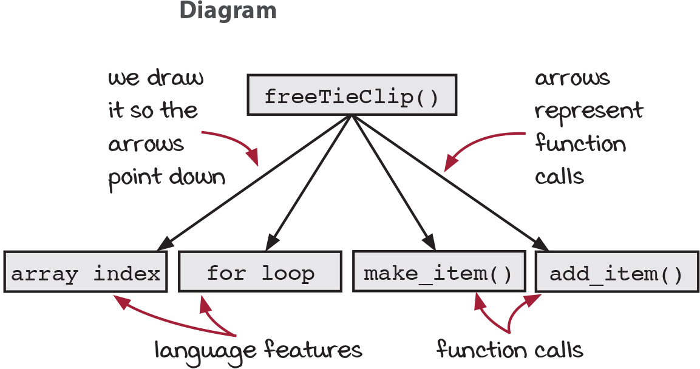
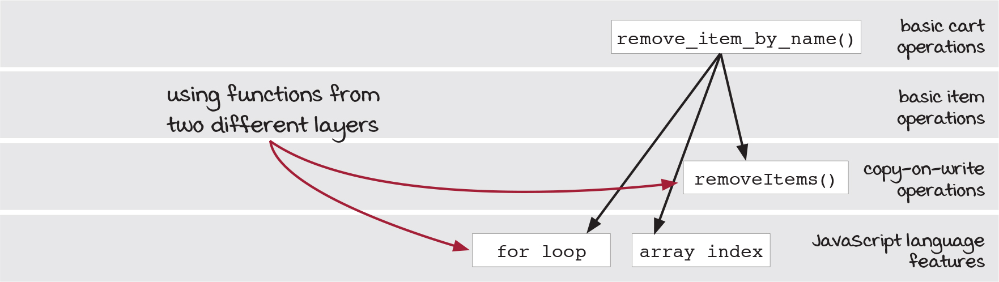
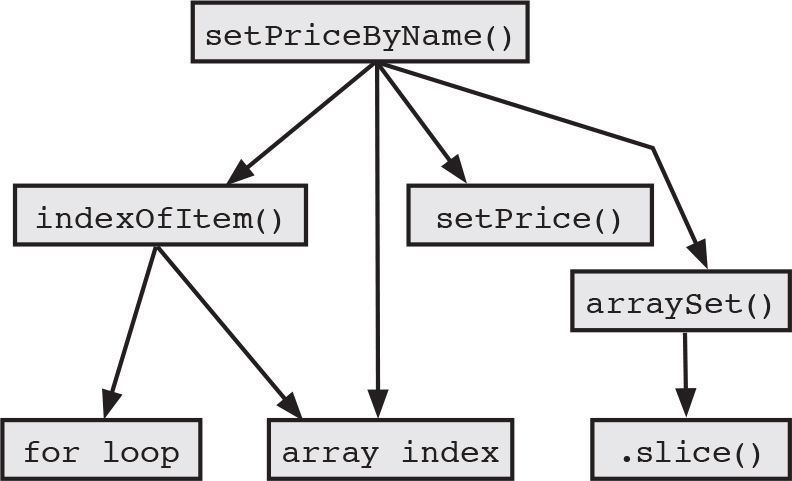

# 8장 계층형 설계 1

## 이번 장에서 살펴볼 내용

- 소프트웨어 설계에 대한 실용적인 정의를 소개합니다
- 계층형 설계를 이해하고 어떤 도움이 되는지 알아봅니다
- 깨끗한 코드를 만들기 위해 함수를 추출하는 방법을 배웁니다
- 계층을 나눠서 소프트웨어를 설계하면 왜 더 나은 생각을 할 수 있는지 알아봅니다

## 소프트웨어 설계란 무엇입니까?

> 제나 : "장바구니는 잘 만들지 못한 것 같아! 장바구니 관련 코드가 전체에 퍼져 있어. 대부분의 시간을 장바구니 관련 작업을 해야 하는데 뭔가 잘못될 거 같아 불안해."

설계가 잘된 코드는 개발 프로세스 전반을 편안하게 만들어줍니다. 아이디어를 코드로 구현하고 테스트하고 유지보수하기 쉽습니다. 그만큼 `소프트웨어 설계`는 중요합니다.

간단히 정의해보겠습니다.

> 소프트웨어 설계
>
> 코드를 만들고, 테스트하고, 유지보수하기 쉬운 프로그래밍 방법을 선택하기 위해 미적 감각을 사용하는 것

이 장에서 이야기해볼 `계층형 설계(stratified design)`은 소프트웨어 설계에 도움이 되는 한 가지 방법입니다.

## 계층형 설계란 무엇인가요?

계층형 설계란 소프트웨어를 계층으로 구성하는 기술입니다. 각 계층에 있는 함수는 바로 아래 계층에 있는 함수를 이용해 정의합니다.

바로 아래 계층에 있는 함수를 이용해 정의한다는 것은 무슨 뜻일까요? 아래 도식을 보세요.



각 계층은 목적(비즈니스 규칙, 장바구니, 카피-온-라이트, 언어 자체 기능)을 가지고 있습니다. 이 부분에 대하여 책에서는 다음과 같이 여러 패턴으로 나누어 설명하고 있습니다.

- 직접 구현 (이번 챕터에서 다룸!)
- 추상화 벽
- 작은 인터페이스
- 편리한 계층

이런 기법들의 핵심은 `코드의 추상화 단계를 맞추기`에 있다고 생각합니다. 하지만 왜 이런 분류를 하는걸까요?

계층을 나누고, 코드의 추상화 단계를 맞추는 것 자체가 절대 선이라서는 아닙니다. 당연히 읽기 좋고 고치기 쉬운 코드를 작성하기 위함입니다. 유지보수하기 좋은 코드는 서비스의 내구성을 높이고 더 빠르게 많은 기능을 구현할 수 있는 기초체력이 됩니다.

책에서는 `직접 구현(Straightforward Implementation)` 단계부터 시작해볼 것을 권하고 있습니다. 직접 구현이라길래 무슨 소리인가 했는데, 코드베이스의 모든 코드를 완전히 직접 구현하고, 직접 함수를 분리하고, 인터페이스를 만드는 등의 작업 방식을 말하는 것이었습니다.

직접 구현하다보면 설계 요령이 생긴다며... 암튼 이후 챕터에서 `추상화 벽` 등을 설명하면서 코드의 모듈화 등을 다루는 것으로 미루어 보았을 때 직접 구현 방식의 한계를 언급하면서 저자가 하고 싶은 말을 하게 될 것 같네요.

예컨대 아래 코드는 책에 제시된 것을 가져온 것인데, 저수준의 로직이 전부 드러나 있습니다. 기능은 구현되어 있지만 설계는 없는 코드입니다.

```ts
function freeTieClip(cart: Cart) {
  let hasTie = false;
  let hasTieClip = false;
  for (let i = 0; i < cart.length; i++) {
    let item = cart[i];
    if (item.name === 'tie') hasTie = true;
    if (item.name === 'tie clip') hasTieClip = true;
  }
  if (hasTie && !hasTieClip) {
    let tieClip = makeItem('tie clip', 0);
    return addItem(cart, tieClip);
  }
  return cart;
}
```

추상화를 하는 이유는 무엇일까요? `추상화의 벽`을 세워서 코드를 분리하면 세부 구현사항을 모두 살펴보지 않고서도 코드를 이해할 수 있게 됩니다. 이는 인간의 머리가 한계를 가지고 있기 때문입니다. 추상화를 통해 코드를 분리하면 코드를 이해하는데 필요한 노력을 줄일 수 있습니다.

이를 거꾸로 뒤집어보자면 머리가 충분히 좋다면 추상화는 불필요합니다. 디자인 패턴은 그 개발팀의 가장 개발 능력이 떨어지는 사람을 위해서 필요하다는 말도 있더라고요. 하지만 그보다 더 구체와 계산에 뛰어난 컴퓨터는 추상화가 필요 없습니다.

추상화에 앞서 아래와 같이 코드를 다이어그램으로 그려 옮겨보면 구조를 개선하기 위한 준비를 보다 효과적으로 할 수 있습니다.



위 다이어그램은 책에서 `호출 그래프`라고 부르는 시각화 방법입니다. 호출 그래프에서 화살표는 아래로 그리며, 각 화살표는 함수 호출을 나타냅니다. 사각형 상자에는 언어 기능이나 함수 호출 등이 담기게 됩니다.

지금 상태로는 `freeTieClip()` 이라는 함수의 바로 아랫 수준에 모든 로직이 같은 수준으로 드러나있습니다.

첫 번째 보여드렸던 그림처럼 호출 그래프에 그려진 각 노드가 동일한 목적과 수준을 가지고 있는지를 살펴서 같은 레이어에 배치하면 아래와 같이 각 노드가 여러 층에 배치될 것이고, 그에 따라 기존과 달리 노드와 노드를 이어주는 화살표의 길이가 서로 달라지게 됩니다.



- 각 노드가 서로 특징에 따라 다른 레이어로 분류되었으나 실제 호출 시점의 코드를 떠올려보면 여전히 고수준과 저수준의 로직이 동시에 호출됩니다. 화살표의 길이도 짧아지는 것이 좋습니다.


- 추상화를 통해 이전에 비해 고수준과 저수준의 로직이 분리되고, 같은 수준의 추상화 로직이 함께 실행됩니다. 최종적으로 분류한 그래프는 다음과 같습니다.



```ts
function setPriceByName(cart, name, price) {
  const i = indexOfItem(cart, name);
  if (i !== null) {
    const item = arrayGet(cart, i);
    return arraySet(cart, i, setPrice(item, price));
  }
  return cart;
}

function indexOfItem(cart, name) {
  for (let i = 0; i < cart.length; i++) {
    if (arrayGet(cart, i).name === name) return i;
  }
  return null;
}

function arrayGet(array, idx) {
  return array[idx];
}

function arraySet(array, idx, value) {
  const copy = array.slice();
  copy[idx] = value;
  return copy;
}
```

아래 목록은 이 책에서 언급한 `직접 구현`의 장점인데요,

- 직접 구현한 코드는 한 단계의 구체화 수준에 관한 문제만 해결합니다
- 계층형 설계는 특정 구체화 단계에 집중할 수 있게 도와줍니다
- 호출 그래프는 구체화 단계에 대한 풍부한 단서를 보여줍니다
- 함수를 추출하면 더 일반적인 함수로 만들 수 있습니다
- 일반적인 함수가 많을 수록 재사용하기 좋습니다
- 복잡성을 감추지 않습니다

저는 이 중 가장 마지막 '복잡성을 감추지 않습니다'에 대한 코멘트가 가장 마음에 들었습니다. 그간 업무를 하며 만들었던 수많은 헬퍼 함수들은 설계가 아닌 그저 분리에 지나지 않았나 반성하게 되네요.

> 직접 구현 패턴을 적용한 코드처럼 보이게 만드는 것은 쉽습니다. 명확하지 않은 코드를 감추기 위해 '도우미 함수(helper function)'를 만들면 됩니다. 하지만 이렇게 하는 것은 계층형 설계가 아닙니다. 계층형 설계에서 모든 계층은 바로 아래 계층에 의존해야 합니다. 복잡한 코드를 같은 계층으로 옮기면 안됩니다. 더 낮은 구체화 수준을 가진 일반적인 함수를 만들어 소프트웨어에 직접 구현 패널을 적용해야 합니다. - 198p

다음 장에서 모듈화의 원칙에 대해서 조금 더 알아보면 실마리가 잡히지 않을까 기대해봅니다. 오늘은 개념의 구분과 필요성의 공감 정도로 충분할 것 같습니다.

## 요점 정리

- 계층형 설계는 코드를 추상화 계층으로 구성합니다. 각 계층을 볼 때 다른 계층에 구체적인 내용을 몰라도 됩니다.
- 문제 해결을 위한 함수를 구현할 때 어떤 구체화 단계로 쓸지 걸졍하는 것이 중요합니다. 그래야 함수가 어떤 계층에 속할지 알 수 있습니다.
- 함수가 어떤 계층에 속할지 알려주는 요소는 함수 이름, 본문, 호출 그래프 등 많이 있습니다.
- 함수 이름은 의도를 알려주므로 의도를 함께하는 유사한 함수들을 묶을 수 있습니다.
- 함수 본문은 중요한 세부사항을 알려줍니다. 함수 본문을 통해 함수가 속해야 할 계층 구조를 알 수 있습니다.
- 호출 그래프로 구현이 직접적이지 않다는 것을 알 수 있습니다. 함수를 호출하는 화살표가 다양한 길이를 가질 경우 직접 구현되어 있지 않다는 뜻입니다 (?)
- 직접 구현 패턴은 함수를 명확하고 아름답게 구현해 계층을 구성할 수 있도록 알려줍니다.
